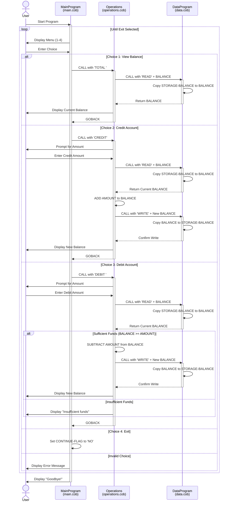

# COBOL Account Management System Documentation

## Overview

This is a legacy COBOL-based Account Management System designed to manage student account balances. The system provides functionality for viewing balances, crediting accounts, and debiting accounts with built-in validation for insufficient funds.

## System Architecture

The system consists of three modular COBOL programs that work together:

1. **main.cob** - User interface and program flow control
2. **operations.cob** - Business logic for account operations
3. **data.cob** - Data persistence layer

---

## File Documentation

### main.cob

**Purpose:** Serves as the main entry point and user interface for the Account Management System.

**Key Functions:**
- `MAIN-LOGIC` - Primary program loop that displays menu and processes user selections

**Data Structures:**
- `USER-CHOICE` (PIC 9) - Stores the user's menu selection (1-4)
- `CONTINUE-FLAG` (PIC X(3)) - Controls program loop execution ('YES'/'NO')

**Program Flow:**
1. Displays a menu with 4 options: View Balance, Credit Account, Debit Account, Exit
2. Accepts user input for menu selection
3. Routes the request to the Operations program using CALL statements
4. Loops until user selects Exit option (4)

**Business Rules:**
- Only accepts menu choices 1-4
- Invalid input results in error message and menu redisplay
- Program terminates gracefully when user selects option 4

---

### operations.cob

**Purpose:** Implements the business logic for all account operations including balance inquiries, credits, and debits.

**Key Functions:**
- **Balance Inquiry (TOTAL)** - Retrieves and displays current account balance
- **Credit Transaction (CREDIT)** - Adds funds to the account
- **Debit Transaction (DEBIT)** - Removes funds from the account with validation

**Data Structures:**
- `OPERATION-TYPE` (PIC X(6)) - Stores the operation being performed ('TOTAL ', 'CREDIT', 'DEBIT ')
- `AMOUNT` (PIC 9(6)V99) - Stores transaction amount (up to $99,999.99)
- `FINAL-BALANCE` (PIC 9(6)V99) - Stores the account balance (initialized to $1,000.00)
- `PASSED-OPERATION` (PIC X(6)) - Linkage parameter receiving operation type from main program

**Business Rules:**
1. **Balance Inquiry:**
   - Reads current balance from data layer
   - Displays balance to user

2. **Credit Operations:**
   - Prompts user for amount to credit
   - Reads current balance
   - Adds credit amount to balance
   - Writes updated balance back to data layer
   - Displays new balance

3. **Debit Operations:**
   - Prompts user for amount to debit
   - Reads current balance
   - **Validates sufficient funds before processing**
   - Only processes if balance ≥ debit amount
   - Displays "Insufficient funds" error if validation fails
   - Updates and displays new balance on success

**Inter-Program Communication:**
- Receives operation type from `MainProgram` via CALL with USING clause
- Calls `DataProgram` for all read/write operations
- Returns control to caller using GOBACK

---

### data.cob

**Purpose:** Manages data persistence and provides an abstraction layer for balance storage.

**Key Functions:**
- **READ operation** - Retrieves the stored balance
- **WRITE operation** - Updates the stored balance

**Data Structures:**
- `STORAGE-BALANCE` (PIC 9(6)V99) - Persistent storage for account balance (initialized to $1,000.00)
- `OPERATION-TYPE` (PIC X(6)) - Internal copy of requested operation
- `PASSED-OPERATION` (PIC X(6)) - Linkage parameter for operation type ('READ'/'WRITE')
- `BALANCE` (PIC 9(6)V99) - Linkage parameter for balance value

**Operations:**

1. **READ Operation:**
   - Copies `STORAGE-BALANCE` to the `BALANCE` linkage parameter
   - Returns current balance to calling program

2. **WRITE Operation:**
   - Copies `BALANCE` linkage parameter to `STORAGE-BALANCE`
   - Persists the updated balance value

**Business Rules:**
- Default initial balance: $1,000.00
- Balance is stored with 2 decimal precision (cents)
- Maximum balance: $99,999.99
- Only responds to 'READ' and 'WRITE' operations
- Data persists in memory during program execution

---

## Student Account Business Rules

### Account Initialization
- All student accounts start with a default balance of $1,000.00
- Balance is stored in memory during program execution

### Transaction Limits
- Maximum balance supported: $99,999.99
- Maximum transaction amount: $99,999.99
- Minimum transaction amount: $0.01 (implied by decimal precision)

### Credit Operations
- No limit on credit amounts (within system maximum)
- Credit operations always succeed if amount is valid
- Balance is immediately updated upon successful credit

### Debit Operations
- **Insufficient Funds Protection:** Debit requests exceeding available balance are rejected
- Error message displayed when insufficient funds
- Balance remains unchanged when debit is rejected
- No overdraft capability

### Data Persistence
- Balance is maintained in working storage during program session
- Balance resets to $1,000.00 on program restart
- No external file or database persistence (in-memory only)

### Validation Rules
- All monetary amounts use 2 decimal places for precision
- Menu input must be numeric (1-4)
- Invalid menu selections trigger error messages but don't terminate program
- Operation types are case-sensitive and must match exactly

---

## Technical Notes

### COBOL Numeric Picture Clauses
- `PIC 9(6)V99` - 6 digits before decimal, 2 after (format: NNNNNN.NN)
- Maximum value: 999999.99
- Supports dollars and cents precision

### Program Communication
- Uses CALL/USING mechanism for inter-program communication
- LINKAGE SECTION defines parameters passed between programs
- GOBACK returns control to calling program

### Future Enhancement Considerations
- Add persistent storage (file or database)
- Implement transaction history logging
- Add multi-user support with unique student IDs
- Implement overdraft limits or alerts
- Add date/time stamps to transactions
- Implement audit trail functionality

---

## Usage Example

```
--------------------------------
Account Management System
1. View Balance
2. Credit Account
3. Debit Account
4. Exit
--------------------------------
Enter your choice (1-4): 1
Current balance: 1000.00

Enter your choice (1-4): 2
Enter credit amount: 500.00
Amount credited. New balance: 1500.00

Enter your choice (1-4): 3
Enter debit amount: 200.00
Amount debited. New balance: 1300.00

Enter your choice (1-4): 3
Enter debit amount: 2000.00
Insufficient funds for this debit.

Enter your choice (1-4): 4
Exiting the program. Goodbye!
```

---

## System Sequence Diagram

The following sequence diagram illustrates the data flow between the three COBOL programs for different operations:



### Diagram Legend

- **MainProgram** - Handles user interface and menu navigation
- **Operations** - Processes business logic for each transaction type
- **DataProgram** - Manages balance storage and retrieval
- **Solid arrows (→)** - Function calls and data requests
- **Dashed arrows (-->>)** - Return statements and responses
- **Activation bars** - Program is actively executing
- **alt/else blocks** - Conditional logic branching
